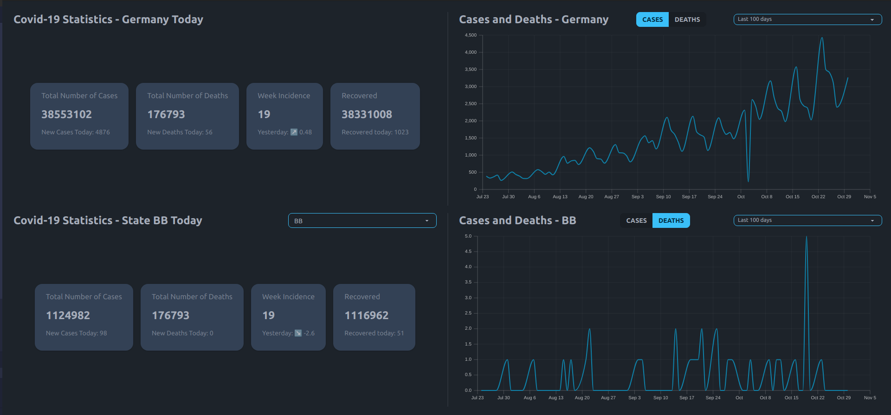

# Covid-19 Use-case

This application provides a serverless REST-API based on AWS Lambda-Function to query covid specific data (cases, deaths) for germany.

Additonally, a small UI for easier access to the data is provided.



### Technologies

**Backend**: Lambda Functions (Typescript) with SST-Framework

**Frontend**: Typescript + React + Vite + TailwindCSS + React Charts

# How to run the application

### Prerequisites

- Node and pnpm installed
- AWS Account with a dedicated IAM User with AdminRights
- AWS CLI installed and configured with corresponding AccessKey and SecretAccessKey of the IAM user

### Start the backend

1. Install all dependencies:

   ```bash
   pnpm install
   ```

2. Start local backend and the propagation of the stub-lambdas (see https://docs.sst.dev/live-lambda-development)

   ```bash
   pnpm sst dev

   # Wait some minutes until everything is initialised
   SST v2.32.2  ready!

   ➜  App:     aaron-usecase
   Stage:   dev
   Console: https://console.sst.dev

   *** wait ***

   ✔  Deployed:
   ApiStack
   ApiEndpoint: https://gybeoggq68.execute-api.eu-central-1.amazonaws.com
   ```

3. The API is now ready and is accessible under given APIEndpoint-URL (for usage see [API-Specification](#api-specification))

### Start frontend

1. Change to frontend directory

   ```bash
   cd ./packages/frontend
   ```

2. Start the frontend (Backend must be running to extract ENV variables to access API-Endpoint - the dev script runs `pnpm sst bind` to load env data into its context)

   ```bash
   pnpm run dev
   ```

# API Specification

The API provides the following GET routes:

- **GET /api/health**

  Function to test whether API is running or not. Returns object containing status and timestamp of the lambda function call.

  Example:

  ```json
  { "status": "alive", "time": "2023-10-31T17:19:49.823Z" }
  ```

- **GET /api/germany**

  Returns current COVID-19 metrics for the whole country.

  Example:

  ```json
  {
    "cases": 34758889,
    "deaths": 151629,
    "recovered": 33017819,
    "weekIncidence": 687.4708933960765,
    "casesPer100k": 41758.877925671724,
    "casesPerWeek": 572231,
    "delta": {
      "cases": 150052,
      "deaths": 209,
      "recovered": 81111,
      "weekIncidence": 6.611232747541408
    },
    "r": {
      "value": 0.82,
      "rValue4Days": { "value": 0.82, "date": "2022-10-14T00:00:00.000Z" },
      "rValue7Days": { "value": 0.85, "date": "2022-10-13T00:00:00.000Z" },
      "lastUpdate": "2022-10-18T02:22:19.000Z"
    },
    "hospitalization": {
      "cases7Days": 9921,
      "incidence7Days": 11.92,
      "date": "2022-10-18T00:00:00.000Z",
      "lastUpdate": "2022-10-18T03:05:26.000Z"
    },
    "meta": {
      "source": "Robert Koch-Institut",
      "contact": "Marlon Lueckert (m.lueckert@me.com)",
      "info": "https://github.com/marlon360/rki-covid-api",
      "lastUpdate": "2022-10-18T00:00:00.000Z",
      "lastCheckedForUpdate": "2022-10-18T20:23:10.902Z"
    }
  }
  ```

- **GET /api/germany/cases**

  Returns the complete record of number of cases since outbreak of COVID-19 for the whole country.

  Example:

  ```json
  {
    "data": [
      {
        "cases": 2,
        "date": "2020-01-01T00:00:00.000Z"
      },
      {
        "cases": 5,
        "date": "2020-01-02T00:00:00.000Z"
      },
      // ...
      {
        "cases": 5409,
        "date": "2021-01-03T00:00:00.000Z"
      }
    ],
    "meta": {
      "source": "Robert Koch-Institut",
      "contact": "Marlon Lueckert (m.lueckert@me.com)",
      "info": "https://github.com/marlon360/rki-covid-api",
      "lastUpdate": "2021-01-03T00:00:00.000Z",
      "lastCheckedForUpdate": "2021-01-04T13:20:30.694Z"
    }
  }
  ```

- **GET /api/germany/cases/{:days}**

  Returns the total cases in germany for the last :days days.

  Example for `:days = 7`:

  ```json
  {
    "data": [
      {
        "cases": 15587,
        "date": "2020-12-28T00:00:00.000Z"
      },
      {
        "cases": 27130,
        "date": "2020-12-29T00:00:00.000Z"
      },
      {
        "cases": 30295,
        "date": "2020-12-30T00:00:00.000Z"
      },
      {
        "cases": 18902,
        "date": "2020-12-31T00:00:00.000Z"
      },
      {
        "cases": 10031,
        "date": "2021-01-01T00:00:00.000Z"
      },
      {
        "cases": 8540,
        "date": "2021-01-02T00:00:00.000Z"
      },
      {
        "cases": 5409,
        "date": "2021-01-03T00:00:00.000Z"
      }
    ],
    "meta": {
      "source": "Robert Koch-Institut",
      "contact": "Marlon Lueckert (m.lueckert@me.com)",
      "info": "https://github.com/marlon360/rki-covid-api",
      "lastUpdate": "2021-01-03T00:00:00.000Z",
      "lastCheckedForUpdate": "2021-01-04T13:26:36.595Z"
    }
  }
  ```

- **GET /api/germany/deaths**

  Returns the complete record of number of deaths since outbreak of COVID-19 for the whole country.

  Example:

  ```json
  {
    "data": [
      {
        "deaths": 0,
        "date": "2020-01-01T00:00:00.000Z"
      },
      {
        "cases": 1,
        "date": "2020-01-02T00:00:00.000Z"
      },
      // ...
      {
        "deaths": 100,
        "date": "2021-01-03T00:00:00.000Z"
      }
    ],
    "meta": {
      "source": "Robert Koch-Institut",
      "contact": "Marlon Lueckert (m.lueckert@me.com)",
      "info": "https://github.com/marlon360/rki-covid-api",
      "lastUpdate": "2021-01-03T00:00:00.000Z",
      "lastCheckedForUpdate": "2021-01-04T13:20:30.694Z"
    }
  }
  ```

- **GET /api/germany/deaths/{days}**

  Returns the total deaths in germany for the last :days days.

  Example for `:days = 7`:

  ```json
  {
    "data": [
      {
        "deaths": 171,
        "date": "2020-12-28T00:00:00.000Z"
      },
      {
        "deaths": 199,
        "date": "2020-12-29T00:00:00.000Z"
      },
      {
        "deaths": 141,
        "date": "2020-12-30T00:00:00.000Z"
      },
      {
        "deaths": 57,
        "date": "2020-12-31T00:00:00.000Z"
      },
      {
        "deaths": 28,
        "date": "2021-01-01T00:00:00.000Z"
      },
      {
        "deaths": 17,
        "date": "2021-01-02T00:00:00.000Z"
      },
      {
        "deaths": 7,
        "date": "2021-01-03T00:00:00.000Z"
      }
    ],
    "meta": {
      "source": "Robert Koch-Institut",
      "contact": "Marlon Lueckert (m.lueckert@me.com)",
      "info": "https://github.com/marlon360/rki-covid-api",
      "lastUpdate": "2021-01-03T00:00:00.000Z",
      "lastCheckedForUpdate": "2021-01-04T13:29:52.846Z"
    }
  }
  ```

- **GET /api/states/{state}**

  Returns the data for a single :state state.

  Example:

  ```json
  {
    "data": {
      "HH": {
        "id": 2,
        "name": "Hamburg",
        "population": 1847253,
        "cases": 37535,
        "deaths": 661,
        "casesPerWeek": 2027,
        "deathsPerWeek": 2,
        "recovered": 27864,
        "abbreviation": "HH",
        "weekIncidence": 109.73050253538634,
        "casesPer100k": 2031.9360693960166,
        "delta": {
          "cases": 0,
          "deaths": 0,
          "recovered": 350
        }
      }
    },
    "meta": {
      "source": "Robert Koch-Institut",
      "contact": "Marlon Lueckert (m.lueckert@me.com)",
      "info": "https://github.com/marlon360/rki-covid-api",
      "lastUpdate": "2021-01-04T00:00:00.000Z",
      "lastCheckedForUpdate": "2021-01-04T13:49:21.375Z"
    }
  }
  ```

- **GET /api/states/{state}/cases**

  Returns all cases for a given state.

  Example for state HH:

  ```json
  {
    "data": {
      "HH": {
        "id": 2,
        "name": "Hamburg",
        "data": [
          {
            "cases": 0,
            "date": "2020-01-01T00:00:00.000Z"
          },
          {
            "cases": 1,
            "date": "2020-01-02T00:00:00.000Z"
          },
          // ...
          {
            "cases": 100,
            "date": "2021-01-03T00:00:00.000Z"
          }
        ]
      }
    },
    "meta": {
      "source": "Robert Koch-Institut",
      "contact": "Marlon Lueckert (m.lueckert@me.com)",
      "info": "https://github.com/marlon360/rki-covid-api",
      "lastUpdate": "2021-01-04T00:00:00.000Z",
      "lastCheckedForUpdate": "2021-01-04T13:49:21.375Z"
    }
  }
  ```

- **GET /api/states/{state}/cases/{days}**

  Returns all cases for a given state for the last given `:days` days.

- **GET /api/states/{state}/deaths**

  Returns complete history of number of deaths since outbreak for given state.

  Example for state HH:

  ```json
  {
    "data": {
      "HH": {
        "id": 2,
        "name": "Hamburg",
        "data": [
          {
            "deaths": 0,
            "date": "2020-01-01T00:00:00.000Z"
          },
          {
            "deaths": 1,
            "date": "2020-01-02T00:00:00.000Z"
          },
          // ...
          {
            "deaths": 100,
            "date": "2021-01-03T00:00:00.000Z"
          }
        ]
      }
    },
    "meta": {
      "source": "Robert Koch-Institut",
      "contact": "Marlon Lueckert (m.lueckert@me.com)",
      "info": "https://github.com/marlon360/rki-covid-api",
      "lastUpdate": "2021-01-04T00:00:00.000Z",
      "lastCheckedForUpdate": "2021-01-04T13:49:21.375Z"
    }
  }
  ```

- **GET /api/states/{state}/deaths/{days}**

  Returns all deaths for a given state for the last given `:days` days.
